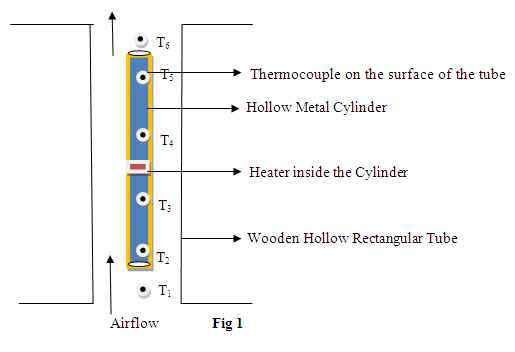

## Procedure

<iframe src="https://www.youtube.com/embed/sy1L7peYU_0" frameborder="0" allow="autoplay; encrypted-media" allowfullscreen></iframe>

### Apparatus

 
 
  
Figure 1: Description of the figure
 

Natural Convection Apparatus - a metal cylinder fitted vertically in a wooden rectangular duct which is open at the top and the bottom (Fig 1). An electric heater is provided in the vertical cylinder, which heats the surface of the cylinder. Heat is lost from the cylinder to the surrounding air by natural convection, because the air in contact with the cylinder gets heated and becomes less dense, causing it to rise. This in turn creates a continuous flow of air upward in the duct. The temperature at the various locations on the surface of the vertical cylinder and in the incoming and outgoing air is monitored with thermocouples. The duct is made of wood because it is a poor conductor, so not much heat will transfer from the air to the duct. Thus the duct will enhance air flow without introducing another convective surface.

### Performing the Simulation:
#### Simulator Controls

 
1.	<strong>Choose materia</strong><strong>l</strong> - This can used to select the material for the metal cylinder.  
2.	<strong>Side of wooden box</strong> - Side of the outer wooden  hollow rectangular box can be varied in cm. 
3.	<strong>Height of wooden box</strong> - Height of the outer wooden hollow rectangular box can be varied in cm. 
4.	<strong>Diameter of cylinder</strong>- Diameter of the vertical cylinder can be varied in cm. 
5.	<strong>Length of the cylinder</strong> - Length of the vertical cylinder can be varied in cm. 
6.	<strong>Thickness of cylinder</strong> - Thickness of the vertical cylinder can be varied in cm. 
7.	<strong>White knob </strong>- can be rotated by clicking the side arrows to adjust the voltage and corresponding current, which can be used to calculate input power. 
8.	<strong>Power On</strong> - click to start the experiment. 
9.	<strong>Temperature indicator </strong>- used to read the temperature at the positions of the various thermocouples. After a steady state is reached (when the timer shows 20 minutes), click the arrows on either side of the knob to read temperatures <em> T1 </em>to <em>T6 </em>in degrees Celsius.

###  Procedure for Simulation

1. Choose a particular material to carry out the experiment. 
2. Choose the height and side of the wooden box with the box sliders. 
3. Adjust the diameter, length and thickness of the cylinder using the cylinder sliders. 
4. Apply a particular voltage and corresponding current using  white knob in the simulator. 
5. Using temperature indicator, note the values of <em>T1, T2, T3, T4, T5 </em>and <em>T6</em> and, using the table and worksheet below,  calculate the heat transfer coefficient and Nusselt number.  
6. Click show result to check your calculations. You can also enter your data in the worksheet on the Simulator to check some of the intermediate quantities in the main calculations.

### Procedure for Real lab
The procedure for a real lab is quite similar, except that the calculations can be extended to include heat loss from the cylinder by radiation, which is often not negligible. For example, at the highest temperatures seen in our simulation, the radiation heat loss would be comparable to the convection heat loss, so only about half the electrical power input would be lost by convection.

### Calculations and Observations

Power input to the heater,

$$\frac{Q}{t}=V\times I = ............W$$

Area of heat transfer, 
$$A=\pi \times d\times L= .............m^{2}$$

$\Delta T$ =Average temperature of the tube - Average temperature of the air

$$\Delta T=\frac{(T_{2}+T_{3}+T_{4}+T_{5})}{4}-\frac{(T_{1}+T_{6})}{2}=......... ^{0}C$$

We hav $Q/t=V\times I$, and by definition

$$h=\frac{VI}{A\Delta T}= .........Wm^{-2}K^{-1}$$

and 

$N=\frac{hL}{k}= ..............$

Where <em>k </em> = 0.024 Wm-1K-1 is the thermal conductivity of air, and<em> L</em> is the length of the cylinder, set by the slider (be sure to convert cm to meters).

## Result

Heat transfer coefficient  h = .......... $Wm^{-2}K^{-1}$

Nusselt number  N                = .....................

